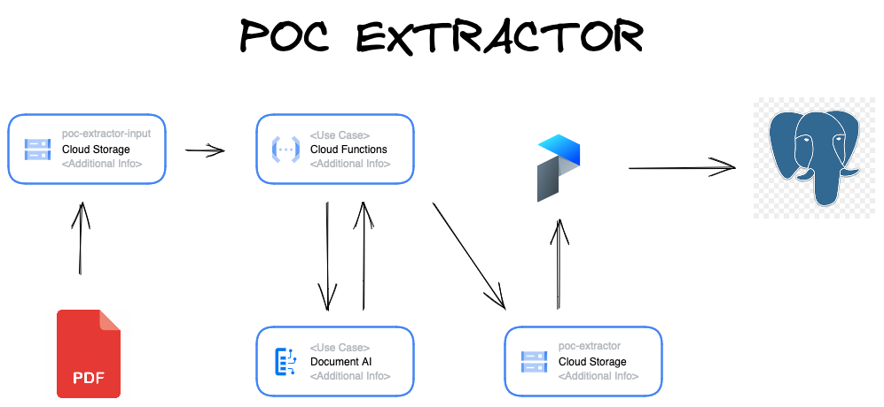

# README




The service-account must have the follwoing roles:

1. Cloud Storage Admin
2. Cloud Function Admin
3. Cloud Document AI Admin

Of course, the above roles creates a over permission issue since the service account ends up having much more permission than should be necessary. There is an open issue to solve this problem. Ideally, one should breakdown the necessary permissions and create a Custom Role and then attach it to the service-account.

Even with three above roles setted the permission `iam.serviceaccounts.actAs` is still necessary. You can set this permission by running:

```bash
gcloud iam service-accounts add-iam-policy-binding aloconcursos-dev@appspot.gserviceaccount.com --member serviceAccount:[YOUR_SERVICE_ACCOUNT] --role roles/iam.serviceAccountUser
```

You should replace `[YOUR_SERVICE_ACCOUNT]` for your service-account email.

Save the service account file as service-account.json in the root of this project, then run:

```
docker compose run --rm terraform init
docker compose run --rm terraform validate
docker compose run --rm terraform plan
```

If all the above commands ran correctly, you can apply the infrastructure:

```
docker compose run --rm terraform apply
```

This will create the cloud function and the following buckets:

1. gs://poc-extractor-function-aloconcursos-dev/
2. gs://poc-extractor-input-aloconcursos-dev/

The application also use a bucket called gs://poc-extractor/, which was already created before hand. Then first bucket store the function code. The second bucket is the input bucket. This bucket receives the files to be processed and serves as the function trigger. Finally, the bucket gs://poc-extractor/ contains the processed files (output from the function), the raw files, and the terraform state.

To run the function, just upload a file to gs://poc-extractor-input-aloconcursos-dev/. The result will be available in gs://poc-extractor/processed/

The file must have maximum 15 pages. See https://cloud.google.com/document-ai/quotas

